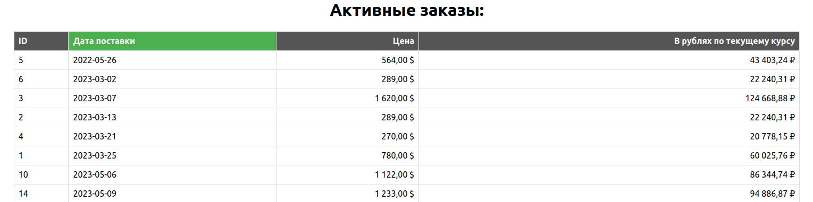

Доделанное https://github.com/v-elvira/numbers_task  
Читает Excel файл из Google Docs, сохраняет в базу данных и выводит содержимое как json Django DRF или React App  

Запуск: `docker-compose up`

Screenshot:

